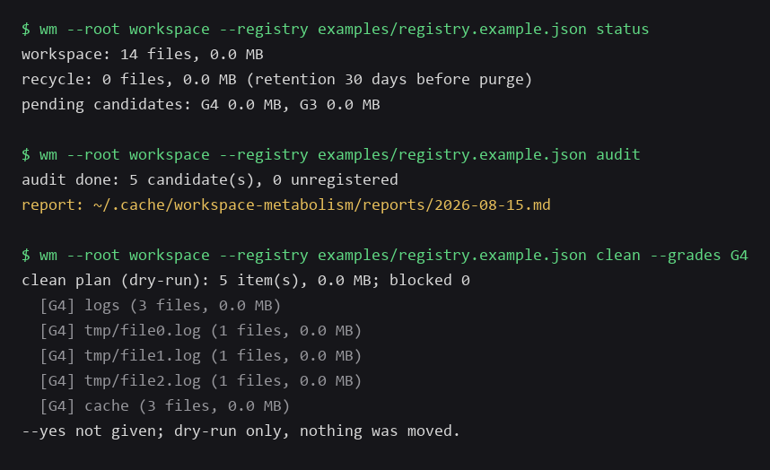

# workspace-metabolism

One policy file controls the whole life cycle of files in your workspace:
classify, audit, clean into a recycle area (rollback anytime), purge, and
verify — every step leaves a hash-chained audit trail. Python 3.11+,
**zero dependencies**, Windows / Linux / macOS.



## Why this exists

Most disk tools either show you space (`ncdu`, `duf`) or delete things
(`rmlint`). `workspace-metabolism` is different: a **policy file** defines what
every path is worth (grades G1–G4), and the tool only ever does what the policy
allows — nothing more.

- **G1 never touch** / **G2 keep** / **G3 approve + reference check** / **G4 auto**
- Deletion is never direct: items move to a recycle area, then `rollback`
  restores them after a per-file SHA-256 integrity check
- Every action lands in a **hash-chained journal**; `verify` detects any edit
- Read-only `audit` reports candidates, unregistered paths, disk alerts, growth
  trend and possible duplicates
- Optional **protected window** (e.g. trading hours, business hours) during
  which marked entries are never touched
- Scheduled runs are supported out of the box on Windows (Task Scheduler) and
  Linux/macOS (cron) via templates in `examples/`

## Quick start

```bash
# install (PyPI release coming; editable install works today)
pip install -e .

# or run without installing anything:
#   PYTHONPATH=src python -m workspace_metabolism --help

# try it on a throwaway workspace (builds demo files, runs status/audit/clean)
python examples/demo.py
```

Point the tool at your own workspace:

```bash
wm --root /path/to/workspace --registry examples/registry.example.json status
wm --root /path/to/workspace --registry examples/registry.example.json audit
wm --root /path/to/workspace --registry examples/registry.example.json clean --grades G4 --yes
wm --root /path/to/workspace --registry examples/registry.example.json rollback <run_id>
```

Copy `examples/registry.example.json`, edit the paths and retention rules, and
register every directory you want to manage. Nothing is cleaned unless it is
registered in the policy file.

## Commands

| Command | What it does |
| --- | --- |
| `audit` | Read-only health check; writes a report and a journal entry |
| `clean --grades G4` | Move expired items to the recycle area (dry-run by default) |
| `clean --grades G3` | Same, but requires `--approve` + `--approver` |
| `rollback <run_id>` | Restore one cleanup run after an integrity check |
| `purge --older-than 30` | Delete expired recycle batches (the only real delete) |
| `verify` | Check the journal hash chain and run manifests |
| `status` | Overview of workspace, recycle area and pending candidates |

Global flags:

| Flag | Meaning |
| --- | --- |
| `--root PATH` | Workspace to govern (default: current directory) |
| `--state-dir PATH` | Journal / recycle / runs / reports (default: system cache directory, **outside** the workspace) |
| `--registry PATH` | Policy registry JSON (required for `audit` / `clean` / `status`) |
| `--protected-window HH:MM-HH:MM` | Weekday window; entries marked `protected` are skipped while active |

The default state directory lives outside the workspace on purpose — a
`git add .` in your project can never sweep the audit journal into version
control.

## Policy file

```json
{
  "version": 1,
  "defaults": {
    "recycle_retention_days": 30,
    "max_item_mb": 2560,
    "disk_alert_free_gb": 20,
    "disk_alert_free_pct": 15,
    "dupe_scan_dirs": ["tmp", "cache"]
  },
  "never_clean": [".git", "README.md", "src"],
  "entries": [
    {"path": "logs", "grade": "G4", "cleanup": "auto", "retention_days": 30},
    {"path": "archive", "grade": "G3", "cleanup": "approve", "retention_days": 60},
    {"path": "**/__pycache__", "grade": "G4", "cleanup": "auto", "retention_days": 30}
  ]
}
```

| Field | Meaning |
| --- | --- |
| `path` | Path or glob (`*`, `**/`) relative to `--root` |
| `grade` | G1 never / G2 keep / G3 approve / G4 auto |
| `cleanup` | `never`, `auto` or `approve` |
| `retention_days` | Idle days before the item becomes a candidate (required unless `cleanup=never`) |
| `scope` | Optional: `files_only` (top-level files of a directory) |
| `protected` | Optional: skip while a `--protected-window` is active |
| `remote_authoritative` | Optional: display marker for data with a remote source of truth |
| `category` | Optional free-form label for your own classification |

## Safety model

- `clean` is dry-run unless `--yes` is given.
- G4 needs `--yes`; G3 needs `--approve` **and** `--approver` (audit trail).
- Items move to the recycle area with per-file SHA-256 hashes; `rollback`
  verifies them before restoring and refuses to overwrite an existing path.
- `purge` is the only command that truly deletes, and only inside the recycle
  area after retention.
- The journal is a hash chain; `verify` detects any tampering.

## Scheduled runs

Templates with `{{PLACEHOLDERS}}` are in `examples/`:

- Windows — `register_schedule.template.ps1`: daily read-only audit (20:30),
  weekly G4 clean (Saturday 10:00), monthly purge (1st, 10:30).
- Linux/macOS — `register_cron.template.sh`: same schedule via cron.

Replace `{{WM_CMD}}`, `{{ROOT}}`, `{{REGISTRY}}`, `{{STATE_DIR}}` (and
`{{USER}}` in cron) with your values. The scripts deliberately do **not**
auto-detect your environment — your paths, your call.

## Development

```bash
python -m pip install -e . pytest
python -m pytest
```

CI runs the full test suite on Ubuntu, Windows and macOS with Python 3.11 and
3.12. Issues are handled on weekends; pull requests are welcome.

## License

MIT
