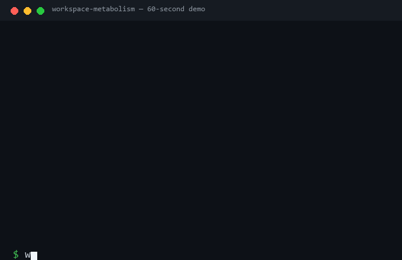

# workspace-metabolism

One policy file controls the whole life cycle of files in your workspace:
classify, audit, clean into a recycle area (rollback anytime), purge, and
verify — every step leaves a hash-chained audit trail. Python 3.11+,
**zero dependencies**, Windows / Linux / macOS.

[](https://pypi.org/project/workspace-metabolism)
[](https://pypi.org/project/workspace-metabolism)
[](https://github.com/metabolism-tools/workspace-metabolism/actions)
[](LICENSE)
[](pyproject.toml)




▶️ Watch the 60-second animated demo: [docs/demo-terminal.html](docs/demo-terminal.html)

**Status:** v0.2.1 — a proposal plus reference implementation. Early days: no
external users yet, and the policy schema may shift before v1.0. Early adopters
are welcome to break it on weird directory structures.

## 中文快速上手（30 秒）

AI 编程（Claude Code / Codex / Aider 等）会在工作区留下大量草稿、缓存和
废弃文件，越堆越多，下一轮 AI 还得在垃圾堆里干活。这个工具用一份策略文件
管理文件的整个生命周期：**检查（只读）→ 回收（可回滚）→ 验证（防篡改记录）
→ 清理**。

```bash
pip install workspace-metabolism        # 安装（零依赖）
python examples/demo.py                 # 30 秒演示：盲删 vs 回收+回滚
wm init                                 # 生成策略文件 metabolism.json
wm audit                                # 只读体检，给文件贴营养标签
wm clean --grades G4 --yes              # 回收过期项（默认 dry-run，确认后加 --yes）
wm rollback <run_id>                    # 删错了？一键原样找回
```

默认只读、绝不直接删文件；每步操作都有防篡改记录；Windows / Mac / Linux 通用。
项目处于早期（v0.2），策略格式在 v1.0 前可能调整。完整英文文档见下文。

## Why this exists

Most disk tools either show you space (`ncdu`, `duf`) or delete things
(`rmlint`). `workspace-metabolism` is different: a **policy file** defines what
every path is worth (grades G1–G4), and the tool only ever does what the policy
allows — nothing more. It is the **policy layer for multi-agent workspaces**:
Claude Code, Codex, Aider, OpenClaw and every other agent share one thing —
your workspace — and the policy governs the byproducts all of them leave
behind, regardless of which tool created them. It fixes no vendor and judges
no file; see [What this is not](docs/positioning.md) before you judge it.

- **G1 never touch** / **G2 keep** / **G3 approve + reference check** / **G4 auto**
- Deletion is never direct: items move to a recycle area, then `rollback`
  restores them after a per-file SHA-256 integrity check
- Every action lands in a **hash-chained journal**; `verify` detects any edit
- Read-only `audit` reports candidates, unregistered paths, disk alerts, growth
  trend and possible duplicates — plus residue on **memory-backed mounts**
  (tmpfs/ramfs: it costs RAM, not just disk)
- Optional **protected window** (e.g. trading hours, business hours) during
  which marked entries are never touched
- Scheduled runs are supported out of the box on Windows (Task Scheduler) and
  Linux/macOS (cron) via templates in `examples/`

### Why not just a scheduled cleanup?

A scheduled task — or asking Codex to "clean up old files" on a timer — gets
you *at some point, files get removed*. `workspace-metabolism` gets you:

- rules that live in the repo (`metabolism.json`), versioned and reviewable
- cleanup that never deletes directly: recycle area, per-file SHA-256, exact
  `rollback`
- a hash-chained journal that detects tampering
- the same behavior on every machine and every run, no AI judgment involved

Scheduling and metabolism are complementary, not rivals: this repo ships cron,
Windows Task Scheduler and CI templates that run `wm` itself. The scheduler
answers *when*; the policy answers *what, how, and how to undo it*.

### What this is not

Four objections come up so often they deserve their own page
([docs/positioning.md](docs/positioning.md)). The short version:

- **Not a fix for vendor bugs** — Claude Code's `/tmp` leak, OpenClaw's
  staged-dir residue: those belong upstream. We govern the workspace, which
  is the one thing every agent shares.
- **Not a heuristic classifier** — no guessing, no AI judgment. Only the
  policy file you wrote decides anything; `wm explain <path>` shows the rule.
- **Not a rival to agent self-cleanup** — agents should clean up after
  themselves; `wm mcp` + session-end hooks make that safe and audited.
- **Not a blind-delete script** — nothing is ever deleted by pattern: items
  move to a recycle area with per-file hashes, and `rollback` restores them.
  `purge` is the only real delete, and only inside the recycle area.

## See it in action

This repo ships a reproducible benchmark: two identical workspaces run 30
simulated agent loops; one ends every loop with `wm clean`, the other never
cleans. The result — **2 active files vs 242** — is a number you can reproduce
yourself:

```bash
python examples/metabolism_benchmark.py
```

A recorded run (2026-08-16, wm 0.2.0) is in
[docs/publish/benchmark-run-20260816.json](docs/publish/benchmark-run-20260816.json)
(raw log:
[docs/publish/benchmark-run-20260816.txt](docs/publish/benchmark-run-20260816.txt)).

## 🧬 Philosophy

`workspace-metabolism` treats your AI-generated workspace as a living system,
inspired by biological metabolism: audit → clean → verify → rollback, with
recyclable cleanup and a hash-chained audit trail. Cleanup is the means;
metabolism is the frame. The one-liner: **loops keep the agent running;
metabolism keeps the workspace alive.** We call this framing **Agentic
Metabolic Engineering**
— managing the byproducts of agent-driven software workspaces. Full write-up:
[docs/philosophy.md](docs/philosophy.md) · [the story](docs/narrative.md) ·
[competitive analysis](docs/competitive-analysis.md) ·
[academic anchors](docs/academic-anchors.md).

## Quick start

```bash
# install from PyPI
pip install workspace-metabolism

# or run without installing anything:
#   PYTHONPATH=src python -m workspace_metabolism --help

# try it on a throwaway workspace (builds demo files; shows the usual
# blind-delete fix vs the wm way: recycle + rollback + journal)
python examples/demo.py
```

Point the tool at your own workspace:

```bash
cd /path/to/workspace
wm init            # scaffold metabolism.json (like `git init`)
wm doctor          # check readiness before the first audit or cleanup
wm audit           # first checkup (read-only)
wm health          # workspace health score (0-100)
wm explain logs    # why a path is graded the way it is
wm clean --grades G4 --yes   # recycle expired G4 items (dry-run without --yes)
wm rollback <run_id>
```

`wm init` scans your workspace and registers common directories (source and
docs as G2 keep, logs/tmp/cache as G4 auto, archive/staging as G3 approve).
Edit `metabolism.json` and commit it like any source file. The tool
auto-discovers `metabolism.json` (or `.wm.json`) in the workspace root, so
`--registry` is optional. Nothing is cleaned unless it is registered in the
policy file. Advanced users can start from
[examples/registry.example.json](examples/registry.example.json).

## Commands

| Command | What it does |
| --- | --- |
| `audit` | Read-only health check; writes a report and a journal entry (also flags sensitive files and git-tracked content) |
| `clean --grades G4` | Move expired items to the recycle area (dry-run by default) |
| `clean --grades G3` | Same, but requires `--approve` + `--approver` |
| `rollback <run_id>` | Restore one cleanup run after an integrity check |
| `purge --older-than 30` | Delete expired recycle batches (the only real delete) |
| `verify` | Check the journal hash chain and run manifests |
| `status` | Overview of workspace, recycle area and pending candidates |
| `init` | Scaffold a `metabolism.json` policy file (like `git init`) |
| `explain <path>` | Show what the policy says about a path (the nutrition label) |
| `health` | Workspace health score (0-100), with `--json` and `--badge` output |
| `doctor` | Read-only readiness check for the workspace, policy, state directory and active locks |
| `mcp` | MCP stdio server so agents can run micro-metabolism themselves |

Global flags:

| Flag | Meaning |
| --- | --- |
| `--root PATH` | Workspace to govern (default: current directory) |
| `--state-dir PATH` | Journal / recycle / runs / reports (default: system cache directory, **outside** the workspace) |
| `--registry PATH` | Policy JSON (optional; auto-discovers `metabolism.json` / `.wm.json`) |
| `--protected-window HH:MM-HH:MM` | Weekday window; entries marked `protected` are skipped while active |

The default state directory lives outside the workspace on purpose — a
`git add .` in your project can never sweep the audit journal into version
control.

`wm doctor` is a read-only preflight check. It reports whether the workspace
and state directory are writable, whether the policy exists and is valid, and
whether another `wm` operation currently holds the state lock. The lock
serializes audits, cleanup, rollback and purge so concurrent scheduled or
agent-triggered runs cannot interleave journal and recycle operations.

## Policy file

```json
{
  "version": 1,
  "defaults": {
    "recycle_retention_days": 30,
    "max_item_mb": 2560,
    "disk_alert_free_gb": 20,
    "disk_alert_free_pct": 15,
    "dupe_scan_dirs": ["tmp", "cache"]
  },
  "never_clean": [".git", "README.md", "src"],
  "entries": [
    {"path": "logs", "grade": "G4", "cleanup": "auto", "retention_days": 30},
    {"path": "archive", "grade": "G3", "cleanup": "approve", "retention_days": 60},
    {"path": "**/__pycache__", "grade": "G4", "cleanup": "auto", "retention_days": 30}
  ]
}
```

| Field | Meaning |
| --- | --- |
| `path` | Path or glob (`*`, `**/`) relative to `--root` |
| `grade` | G1 never / G2 keep / G3 approve / G4 auto |
| `cleanup` | `never`, `auto` or `approve` |
| `retention_days` | Idle days before the item becomes a candidate (required unless `cleanup=never`) |
| `scope` | Optional: `files_only` (top-level files of a directory) |
| `protected` | Optional: skip while a `--protected-window` is active |
| `remote_authoritative` | Optional: display marker for data with a remote source of truth |
| `category` | Optional free-form label for your own classification |
| `owner` | Optional: who is accountable for this rule |
| `intent` | Optional: why this rule exists |
| `review_after` | Optional: when this rule should be revisited |

The policy format is versioned and validated against
[schema/metabolism.schema.json](schema/metabolism.schema.json), so editors and
agents can check your file before the tool does.

## Health score

`wm health` combines the audit summary into one number from 0 to 100: 25
points for journal auditability, 25 for governance (unregistered paths, disk
alerts), 35 for rot burden (expired candidates), and 15 for recycle
readiness. Grades: A (90+), B (75+), C (60+), D (below).

```bash
wm health --json
wm health --badge   # shields.io endpoint JSON for a README badge
```

The badge above is generated from [docs/health.json](docs/health.json). A CI
template that fails when the score drops below a threshold is in
[examples/ci-audit.yml](examples/ci-audit.yml).

## Agents

`wm mcp` runs a zero-dependency MCP stdio server. Agents can audit, explain,
and run dry-run clean plans themselves; `clean` only executes when the caller
explicitly passes `execute=true`, and the policy file still decides
everything. The end-of-loop ritual is automated in
[examples/micro_metabolism.py](examples/micro_metabolism.py) — wire it into a
session-end hook so every loop ends with a checkup.

## Safety model

- `clean` is dry-run unless `--yes` is given.
- G4 needs `--yes`; G3 needs `--approve` **and** `--approver` (audit trail).
- **Sensitive files are never auto-cleaned**: `audit` flags secrets/keys/credentials
  (`.env*`, `*.pem`, `*.key`, `*token*`, `*secret*`, `*credential*`, `id_rsa`, …) in a
  dedicated report section, the policy validator refuses to register a sensitive path
  as G4 auto-clean, and `clean` skips any candidate that contains sensitive files.
- **Git-aware classification**: in a git repo, tracked files count as controlled by git
  (effectively G2) — they are excluded from the audit's unregistered list, and `clean`
  skips candidates that contain git-tracked files. Non-git workspaces fall back to pure
  policy matching. (Git is optional; `wm` never depends on it.)
- Items move to the recycle area with per-file SHA-256 hashes; `rollback`
  verifies them before restoring and refuses to overwrite an existing path.
- `purge` is the only command that truly deletes, and only inside the recycle
  area after retention.
- The journal is a hash chain; `verify` detects any tampering.

## Scheduled runs

Templates with `{{PLACEHOLDERS}}` are in `examples/`:

- Windows — `register_schedule.template.ps1`: daily read-only audit (20:30),
  weekly G4 clean (Saturday 10:00), monthly purge (1st, 10:30).
- Linux/macOS — `register_cron.template.sh`: same schedule via cron.

Replace `{{WM_CMD}}`, `{{ROOT}}`, `{{REGISTRY}}`, `{{STATE_DIR}}` (and
`{{USER}}` in cron) with your values. The scripts deliberately do **not**
auto-detect your environment — your paths, your call.

## Development

```bash
python -m pip install -e . pytest
python -m pytest
```

CI runs the full test suite on Ubuntu, Windows and macOS with Python 3.11 and
3.12. Issues are handled on weekends; pull requests are welcome.

## Project family

Sister organization: [Foolproof Labs](https://github.com/foolproof-labs) — a
toolchain against self-deception in quantitative research:

- [`falsification-ledger`](https://github.com/foolproof-labs/falsification-ledger) — pre-registration and falsification ledger
- [`factor-qc`](https://github.com/foolproof-labs/factor-qc) — fail-closed backtest quality gate
- [`pit-adjuster`](https://github.com/foolproof-labs/pit-adjuster) — PIT back-adjustment with drift detection
- [`lookahead-free`](https://github.com/foolproof-labs/lookahead-free) — verifiable look-ahead-freedom checks
- [`ashare-data-immunity`](https://github.com/foolproof-labs/ashare-data-immunity) — data immunity for A-share daily bars
- [`lesson-book`](https://github.com/foolproof-labs/lesson-book) — tuition memory for traders

If `workspace-metabolism` keeps the *workspace* alive, Foolproof Labs keeps
the *research* honest.

## License

MIT
