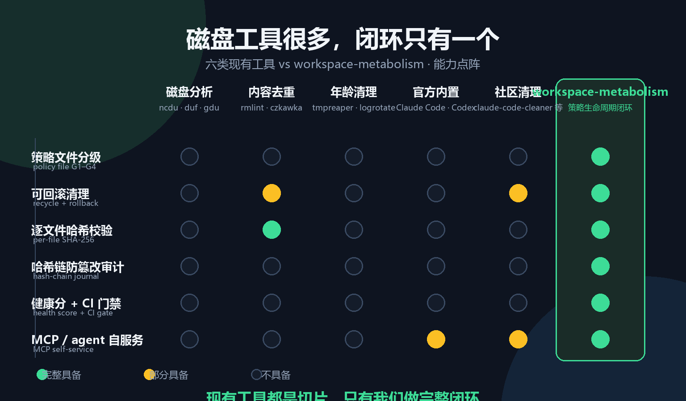

# 竞品分析：AI 智能体工作区文件生命周期治理

> 调研时间：2026-08（以当时可获得的公开资料为准，来源 URL 见文末）。
> 本文是 [philosophy.md](philosophy.md) §5 对比表的完整版：哲学文档回答"我们为什么不同"，本文回答"市场里都有谁、缺口在哪、我们该怎么打"。
> 学术侧对应文档：[academic-anchors.md](academic-anchors.md)。

*图：六类现有工具 vs workspace-metabolism 的能力点阵（绿色=完整具备，琥珀=部分具备，灰色=不具备；生成脚本 `tools/make_competition_image.py`，英文版 `competitive-gap-en.png`）。*

## 0. 结论先行（TL;DR）

1. **需求已被多方验证**：Claude Code 官方 issue 里堆出数百 GB 级垃圾（单会话输出文件 350GB/537GB 的报告都有），社区半年内涌现十余个"agent 清理"工具，"context rot / workspace rot / agent hygiene" 已成为标准术语。这个品类真实存在且在增长。
2. **现有供给全是"切片"**：经典工具管"诊断/去重/年龄清理"，官方能力只清"自家状态目录"，社区工具清"会话/缓存/进程"。**没有任何工具做"策略文件定义价值分级 → 可回滚清理 + 逐文件哈希校验 → 哈希链审计 → 健康分门禁 → MCP 自服务"的完整闭环**——这正是我们的位置。
3. **两个心智已被教育好**：声明式配置（.gitignore / systemd-tmpfiles / logrotate）与"回收站可恢复"（trash-cli）。metabolism.json + 回收区恰好复用这两个心智，学习成本低。
4. **五个空白点**：政策即代码 + G1–G4 分级、可回滚 + 防篡改审计、MCP 自服务、CI 门禁 + 健康分、**agent-agnostic（不绑死任何一家 agent 的状态目录）**。
5. **主要威胁**：官方内置清理持续增强；claude-code-cleaner 这类工具抢占"清 ~/.claude"的心智；helm-agent-ops 抢占 "agent workspace ops" 命名空间。

---

## 1. 品类定义与需求侧证据

本品的竞争带是：**"AI 智能体反复循环在工作区落盘后，谁负责这些产物的生命周期"**。它不是磁盘清理，不是去重，不是日志轮转——但所有这些都共享同一批用户注意力，所以都在本报告范围内。

需求侧的硬证据（2025–2026）：

- Claude Code 官方仓库 issue：`~/.claude` 无上限增长撑爆磁盘并破坏配置（[#24207](https://github.com/anthropics/claude-code/issues/24207)）；单个 session JSONL 可达多 GB（[#18905](https://github.com/anthropics/claude-code/issues/18905)、[#19040](https://github.com/anthropics/claude-code/issues/19040)）；单次会话任务输出文件涨到 **350GB**（[#33670](https://github.com/anthropics/claude-code/issues/33670)）甚至 **537GB**（[#26911](https://github.com/anthropics/claude-code/issues/26911)）；社区请求官方为 `~/.claude` 加自动 GC（[#24486](https://github.com/anthropics/claude-code/issues/24486)）；`cleanupPeriodDays` 语义混乱（[#23710](https://github.com/anthropics/claude-code/issues/23710)、[#51779](https://github.com/anthropics/claude-code/issues/51779)）；连 `.claude/worktrees/agent-*` 都有清理诉求（[#55435](https://github.com/anthropics/claude-code/issues/55435)）。
- 社区工具爆发：claude-code-cleaner、CC-Cleaner、claude-maintain、cozempic、agent-gc、artifact-guard、Dev-Janitor 等十余个工具在 2025–2026 涌现（详见 §3）。
- 概念术语成熟："context rot / workspace rot" 已进入社区话语（[Depot: Context isolation in coding agent loops](https://depot.dev/blog/context-isolation-in-coding-agent-loops)、[ai-agent-handbook](https://github.com/vasilyevdm/ai-agent-handbook)、[Tokalator 论文引用 context rot](https://ar5iv.labs.arxiv.org/html/2604.08290)）。
- 学术侧（见 [academic-anchors.md](academic-anchors.md) §7）：context rot 已有直接命名的论文、可控基准（LOCA-bench）、多智能体失败分类（MAST）。

---

## 2. 竞品全景：六个类别

### 2.1 经典磁盘/文件清理与分析工具

解决"哪里占空间、删什么"的**只读诊断 + 人工删除**，无价值分级、无回滚、无审计。

| 工具 | 定位 | 与我们差异 | 威胁/借鉴点 |
|---|---|---|---|
| ncdu | 终端 NCurses 磁盘占用浏览器 | 只诊断不治理 | 借鉴交互式 TUI 直觉，可作 `explain`/`audit` 可视化入口 |
| duf / dust / dua / gdu | `df`/`du` 的现代替代，树状可视化（Rust/Go） | 纯分析 | 性能叙事压力；需用"审计快照 + 增量"对冲全量扫描成本 |
| baobab / WinDirStat / WizTree / TreeSize / SpaceSniffer | 各平台 GUI 磁盘可视化 | GUI 单机，无策略/CI 门禁 | 人群不重叠；"一键看占用"的即时满足感是我们的空白 |
| DaisyDisk | macOS 商用可视化 | 同上 | 商业化与视觉品牌参照 |
| CleanMyMac X / CCleaner / BleachBit | 一键"垃圾清理" | 启发式，无分级/校验/回滚 | **威胁**："一键清理"心智；我们用 G1/G2 保护 + 可回滚建立信任 |
| Storage Sense / macOS 优化存储 / OneDrive Files On-Demand | 系统内置自动清理 + 云占位 | 只碰系统缓存/云同步 | 说明系统级清理覆盖不到工作区，是我们的存在理由 |

### 2.2 去重工具

按内容哈希找重复文件。交集只有"用哈希做判断"。

| 工具 | 定位 | 与我们差异 | 威胁/借鉴点 |
|---|---|---|---|
| rmlint | 高速去重 + lint（空目录、坏软链等） | 纯内容层 | 借鉴多 lint 类型与脚本化输出；"文件清理瑞士军刀" |
| fdupes / jdupes | 经典/现代命令行去重 | 同上 | SHA-256 校验思路同源，文档可类比 |
| dupeguru / czkawka | GUI/多合一去重（含相似图片） | 内容特征导向，无价值分级 | czkawka 已把"临时文件"纳入扫描，是功能扩散信号；其清理仍无审计与回滚 |

### 2.3 临时/旧文件自动清理与轮转

按年龄/大小/类型规则自动清理——最接近"生命周期"的经典类别，但规则是全局启发式，无可回滚+校验的清理语义。

| 工具 | 定位 | 与我们差异 | 威胁/借鉴点 |
|---|---|---|---|
| tmpreaper / tmpwatch | 定时按 mtime 清理 /tmp 等 | 纯年龄规则，删除不可回滚 | 定时器模型 + 白名单思想 → 对应 G1/G2 |
| logrotate | 日志轮转（大小/时间压缩归档） | 面向日志流 | "轮转→归档→淘汰"三阶段心智对应 G3/G4 |
| agedu | 按文件年龄统计占用（Joey Hess） | 只诊断"多久没访问" | "最后访问时间"可作 G4 判定的默认特征 |
| systemd-tmpfiles | 声明式 tmp 清理（conf + 年龄规则） | 声明式但无分级/审计/回滚 | **借鉴**：声明式配置文件心智已被教育过 |
| trash-cli | 命令行回收站（trash/restore/list） | 只有回收站层 | **借鉴**：我们的 clean/rollback 是其"策略化 + 校验化"升级 |
| autotrash | 按年龄自动清空回收站 | 无引用检查 | 自动淘汰需加 G3 引用检查兜底 |

### 2.4 2024–2026 新兴"AI 智能体工作区卫生/上下文管理"工具（重点）

#### A. 官方内置能力

| 能力 | 定位 | 与我们差异 | 威胁/借鉴点 |
|---|---|---|---|
| Claude Code `cleanupPeriodDays` / 会话清理 | 官方按天数保留历史/备份 | 只清自家状态目录（`~/.claude`、transcripts），不治理工作区项目文件 | **威胁**：官方在收敛自己的垃圾；但我们管"agent 在工作区写的文件"，二者互补 |
| Claude Code `/compact` `/clear` / sandbox | 上下文压缩/清空/沙箱文件系统 | 管上下文与会话，不管磁盘文件 | "上下文腐烂"已获官方关注，文件代谢是它的磁盘侧对应物 |
| Codex `/clear` `/reset` `--sandbox` `--full-auto` | 会话重置 + 沙箱 + 写限制 | 沙箱限制"agent 能写哪"，不管"写完留下的废物" | G1 分级 = 工作区级沙箱白名单 |

#### B. 社区工具（直接竞品/近邻）

> 对三个代表性近邻（cozempic / artifact-guard / helm-agent-ops）的**逐命令级深度对比**（3 张命令对照表、wm 独有能力矩阵、8 条可执行借鉴点、诚实标注清单）见 [docs/research/competitor-command-diff.md](research/competitor-command-diff.md)。

| 工具 | 定位 | 与我们差异 | 威胁/借鉴点 |
|---|---|---|---|
| cozempic（Ruya-AI） | Claude Code 上下文减脂：修剪膨胀会话、**分级修剪保护** | 管会话/上下文；无文件回收/哈希/审计 | 证明"分级修剪"心智有效——与 G1–G4 同构，命名可互相借鉴 |
| claude-code-cleaner（GarrickZ2） | TUI 清理 `~/.claude`（孤立缓存、旧会话、日志、遥测） | 只清 Claude 自家状态目录；无回滚/校验 | **最直接近邻**；证明痛点真实，但停留在"清缓存"层面 |
| CC-Cleaner（tk-425） | Web GUI 管理/清理 Claude Code 项目 | 同上，GUI 化 | 界面友好是长板；我们补 CLI/CI/MCP |
| claude-maintain / claude-cleaner（ePlus-DEV） | 清理 Claude Code 会话/历史/token 数据的维护 CLI | 同左 | 细分工具爆发印证；差异化空间在"通用工作区"而非"某一家的状态目录" |
| agent-session-manager / claude-session-manager-mcp | 管理/恢复会话（TUI、GTK、MCP 服务器） | 会话生命周期，非文件生命周期 | MCP 自服务方向有人在做（session 级）；文件级是空白 |
| conductor（Jinghao67） | 主会话保持干净、"dirty sidecar"会话探索 | 上下文隔离架构 | 借鉴"干净/脏"分层 → 对应 G1/G2 |
| helm-agent-ops | 面向"长生命周期 agent 工作区"的稳定性运维 CLI | 偏稳定性/进程，非文件价值治理 | **关注**：抢占了 "agent workspace ops" 命名空间 |
| artifact-guard（ekta-chaudhry） | 面向 AI 辅助开发工作流的隐私感知工件生命周期管理器 | 概念最接近（artifact lifecycle），弱在策略分级/回收/审计 | 直接对标对象 |
| agent-gc（npm） | 对 agent 产物做"垃圾回收" | 概念撞名"GC"，实现浅 | 需求自发的证据；我们需在深度上碾压 |
| z-clean / @thestackai/zclean | 清理 AI 编程工具遗留的僵尸进程/MCP 服务器 | 进程级，非文件级 | 文件级是相邻空白 |
| ghostcleaner（daiokawa）/ Dev-Janitor（cocojojo5213） | 清理 agent 遗留进程 / 开发者机器通用清理 | 通用清理，非策略化 | 大众化"清理"心智；我们靠策略/审计/CI 差异化 |
| vibe-janitor、doc-cleanup、doey-purge、`clean` SKILL | 一次性"技能式"清理脚本 | 无持久策略、无校验、无回滚 | **重要信号**：用户正用 SKILL 拼凑我们的功能 |
| alint（asamarts） | 仓库结构 linter，内置 agent-hygiene 规则集 | 静态 lint，非清理执行 | agent-hygiene 规则集可作 G3 引用检查参考 |

> 注：philosophy.md §5.1 中列出的 `vanish`（PyPI）在本轮调研中未能独立核实，引用其详情前请自行确认。

#### C. 与我们的完整闭环对比

| 能力 | 官方内置 | 社区清理工具 | 经典工具 | **workspace-metabolism** |
|---|---|---|---|---|
| 策略文件分级（G1–G4） | ❌ | ❌ | ❌ | ✅ |
| 清理永不直接删除（回收区） | ❌ | 部分（可配 move） | ❌ | ✅ |
| 逐文件 SHA-256 + 精确 rollback | ❌ | ❌ | ❌ | ✅ |
| 哈希链审计 + verify | ❌ | ❌ | ❌ | ✅ |
| 健康分 + CI 门禁 | ❌ | ❌ | ❌ | ✅ |
| MCP 自服务 | 部分（官方插件） | ❌ | ❌ | ✅ |
| agent-agnostic | ❌（各自家） | ❌（基本绑 Claude） | n/a | ✅ |

### 2.5 相邻概念产品（git/CI/容器/k8s/漂移）

| 工具/概念 | 定位 | 与我们差异 | 威胁/借鉴点 |
|---|---|---|---|
| git clean / git gc | 清理未跟踪文件 / 压缩对象库 | 只管 git 对象 | .gitignore 心智是"标准工件"隐喻来源；git gc = 仓库级代谢先例 |
| git-filter-repo / BFG | 历史重写 | 非运行时清理 | "破坏性操作需强校验"的叙事 |
| CI 磁盘回收（easimon/maximize-build-space 等） | 构建前腾空间 | 一次性、runner 维度 | CI 门禁 + 定时任务是既定场景，可打包成 GitHub Action |
| docker system prune | 清理悬空镜像/容器/卷/缓存 | 容器层 | "dry-run + 强制标志 + 可配置保留期"的 CLI 语义范本 |
| k8s kubelet GC | 按阈值自动回收 | 集群级自动 GC | "高低水位 + 自动回收"模型 → health 分/G4 可对应 |
| driftctl（snyk）等漂移检测 | 检测 IaC 期望态与实际漂移 | 配置漂移 ≠ 文件漂移 | **借鉴**：metabolism.json 包装成"期望状态"，audit = 漂移检测，叙事直接可类比 |

### 2.6 SaaS / 商业产品

| 产品 | 定位 | 与我们差异 | 威胁/借鉴点 |
|---|---|---|---|
| CleanMyMac X / DaisyDisk / TreeSize / CCleaner / WizTree | 商用磁盘清理/可视化 | 通用单机，无 agent 场景 | 商业变现与品牌参照 |
| Hazel（Noodlesoft） | macOS 规则驱动文件自动整理 | 规则是"行为"（移到哪），非价值分级+审计 | metabolism.json 是"策略化 Hazel" |
| GitHub Codespaces / Gitpod | 云环境 + 自动删除空闲环境 | 环境级生命周期（整机销毁） | 云"销毁即清理"是替代路径——本地/混合开发仍是主流 |
| Depot（remote agent sandboxes） | agentic 工程远程沙箱 + context isolation | 基础设施层 | 关注其 "context isolation" 叙事；我们宣称"文件级隔离" |
| Nexos.ai 等企业 AI 治理平台 | 企业级 AI 治理/合规 | 治理面不同 | 趋势参考，非直接竞争 |

---

## 3. 竞争格局总结与差异化机会

### 3.1 格局总结

1. 需求已验证、术语已成熟（见 §1）。
2. 现有供给是"切片"：诊断（ncdu/duf）、去重（rmlint/czkawka）、年龄清理（tmpreaper/logrotate）、官方状态目录（Claude/Codex 内置）、会话/缓存/进程（社区工具）。**没有任何竞品把"价值分级策略 + 可回滚清理 + 防篡改审计 + 健康门禁 + agent 自服务"做成一个闭环**。
3. 心智已被教育好：声明式配置与回收站语义——我们复用，学习成本低。

### 3.2 五个差异化空白点

1. **政策即代码 + 四层分级**：所有竞品都是启发式或单维度规则；G1–G4（含 G3 审批 + 引用检查）是唯一把"文件价值"显式建模的方案。
2. **可回滚 + 哈希校验 + 防篡改审计**：竞品删除不可逆/无校验；verify/rollback 形成"可被合规审计的清理"，直击企业顾虑（对应学术锚点：Haber & Stornetta、Schneier & Kelsey）。
3. **MCP 自服务**：让 agent 自己调用清理而非用户手动，是"agent 时代的运维"叙事；目前只有 session 级 MCP 服务器，文件级是空白。
4. **CI 门禁 + 健康分**：把"工作区卫生"变成可量化门禁（类 driftctl 漂移检测叙事），竞品都没有。
5. **Agent-agnostic**：Claude/Codex/开源 agent 通吃；现有工具几乎全部绑死单一 agent 的状态目录——最容易被忽视的差异化点。

### 3.3 主要威胁与应对

| 威胁 | 应对 |
|---|---|
| 官方内置清理能力持续增强（Claude Code cleanupPeriodDays 等） | 避开"抢状态目录"正面冲突；坚持"通用工作区 + 策略化 + 可审计"，强调互补 |
| claude-code-cleaner 等抢占"清 ~/.claude"心智 | 定位差异：它们清官方目录，我们治理"agent 在你项目里写的文件" |
| helm-agent-ops 抢占 "agent workspace ops" 命名空间 | 尽早确立 "metabolism / lifecycle / hygiene layer" 的独特词汇（Metabolic Debt、Workspace Rot） |
| 一键清理心智（CCleaner 等） | 把"保护 + 可回滚 + 可解释"作为信任卖点；G1/G2 默认保护做进 demo |
| 云环境"销毁即清理"替代本地清理 | 本地/混合开发仍是主流；主打"不销毁环境、只治理产物" |

---

## 4. 对项目下一步的可执行建议

1. **文档定位升级**：把本文 §3.2 的五个空白点提炼成 README 的 "Why this is not a cleaner" 段落，配一张"全景图：六类工具 vs 我们"的对比图（可复用 docs/publish 的图片生成脚本风格）。
2. **功能优先级**（结合 ROADMAP）：
   - 短期：Claude Code / Codex session-end hooks（切入社区工具主战场）；GitHub Action 封装（CI 门禁落地）。
   - 中期：`audit` 增加"失效引用检测"（对标 reference rot 与 rmlint 的 lint 类型）；`clean` 的 G4 默认特征增加"最后访问时间"（agedu 维度）。
   - 长期：健康分的多维度加权公式显式化（对标 Wang & Strong 15 维框架）；策略 Schema v2 的 review 工作流（owner/intent/review_after 已有字段）。
3. **命名与叙事**：与 helm-agent-ops 等"ops"命名错开，巩固 "metabolism / metabolic debt / workspace rot" 词汇；在发布文案中明确"我们不是第 N 个清理 ~/.claude 的工具"。
4. **验证节奏**：用 outreach 文档里的真实痛点（Claude Code #8856、OpenClaw #104358）做对照实验：先在用户真实工作区跑 `wm audit`（只读），再邀请试用 clean/rollback。
5. **警惕功能蔓延**：czkawka 的教训——别把去重/相似图片/进程清理都吞进来；守住"策略驱动的生命周期"主线，其他能力以"引用检查/审计报告"形式出现而非新命令。
6. **吸收近邻的 8 条借鉴点**（详见 [competitor-command-diff.md](research/competitor-command-diff.md) §3）：① 阈值阶梯守护（`guard --daemon`）；② 在途进程保护（safe-point）；③ 敏感文件类别（拒绝注册为 G4）；④ git-aware 分类（tracked 默认 G2）；⑤ `session start/finish` 会话基线；⑥ `clean --profile` 执行档案门控；⑦ `--shadow` 累积账纳入健康分；⑧ `reconcile` 规则-目录漂移检测。其中 ③④ 直接补上当前最明显的隐私短板，⑤ 正好补全 micro-metabolism 的端循环仪式。

---

## 5. 来源清单（关键）

- Claude Code issues：[#24207](https://github.com/anthropics/claude-code/issues/24207)、[#18905](https://github.com/anthropics/claude-code/issues/18905)、[#19040](https://github.com/anthropics/claude-code/issues/19040)、[#33670](https://github.com/anthropics/claude-code/issues/33670)、[#26911](https://github.com/anthropics/claude-code/issues/26911)、[#24486](https://github.com/anthropics/claude-code/issues/24486)、[#23710](https://github.com/anthropics/claude-code/issues/23710)、[#51779](https://github.com/anthropics/claude-code/issues/51779)、[#55435](https://github.com/anthropics/claude-code/issues/55435)
- 社区工具：cozempic、claude-code-cleaner、CC-Cleaner、claude-maintain、claude-cleaner、agent-session-manager、claude-session-manager-mcp、conductor、helm-agent-ops、artifact-guard、agent-gc、zclean、ghostcleaner、Dev-Janitor、vibe-janitor、doc-cleanup、doey-purge、alint（仓库/包页链接见正文各表）
- 概念与生态：[Depot context isolation](https://depot.dev/blog/context-isolation-in-coding-agent-loops)、[ai-agent-handbook](https://github.com/vasilyevdm/ai-agent-handbook)、[Claude Code settings](https://code.claude.com/docs/en/settings)、[Codex slash commands](https://mintlify.wiki/openai/codex/features/slash-commands)、[MCP filesystem（ellmos-filecommander-mcp）](https://github.com/ellmos-ai/ellmos-filecommander-mcp)、[mcp-virtual-fs](https://www.npmjs.com/package/mcp-virtual-fs)、[driftctl](https://github.com/snyk/driftctl)、[Codespaces 自动删除](https://docs.github.com/en/codespaces/setting-your-user-preferences/configuring-automatic-deletion-of-your-codespaces)、[Depot remote agent sandboxes](https://depot.dev/blog/now-available-remote-agent-sandboxes)
- 经典工具：tmpreaper、agedu、trash-cli、systemd-tmpfiles、rmlint、czkawka、duf、WinDirStat、docker system prune、kubelet GC、git-filter-repo、easimon/maximize-build-space（链接见正文各表）

> 免责：社区工具多为快速迭代的小项目，名称、定位与仓库地址可能随时间变化；引用前请在原链接复核。
